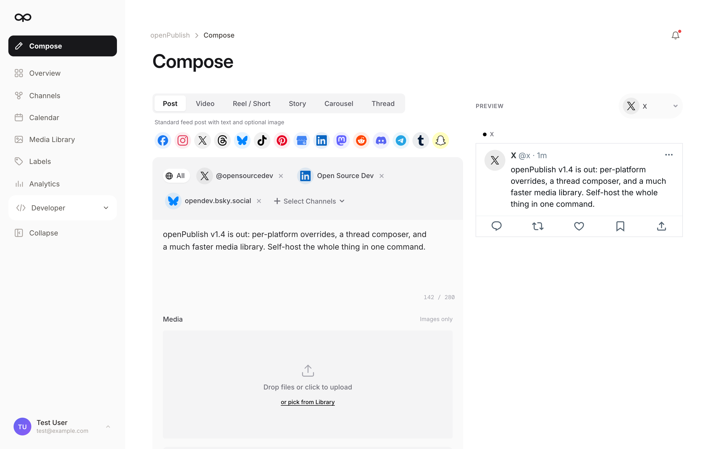
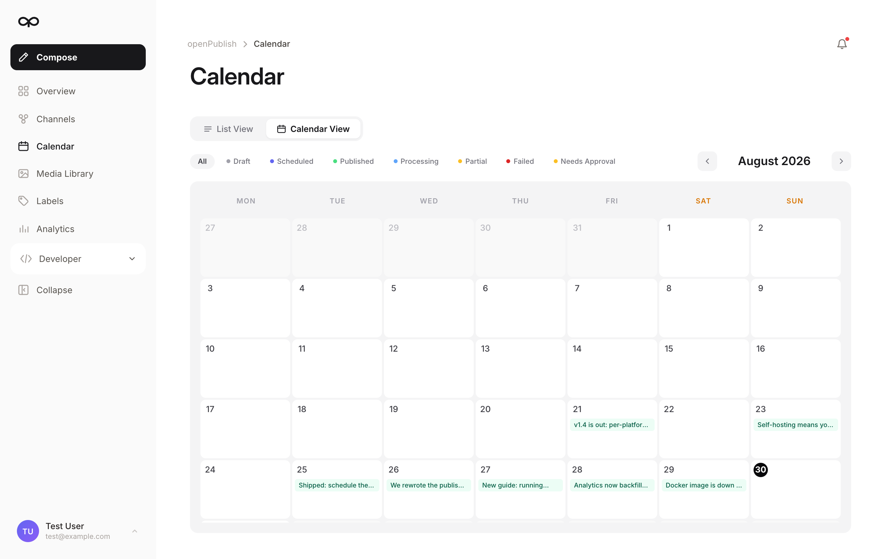
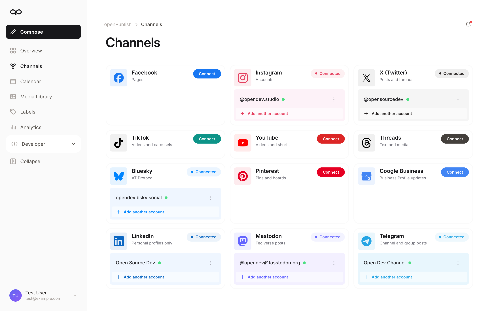
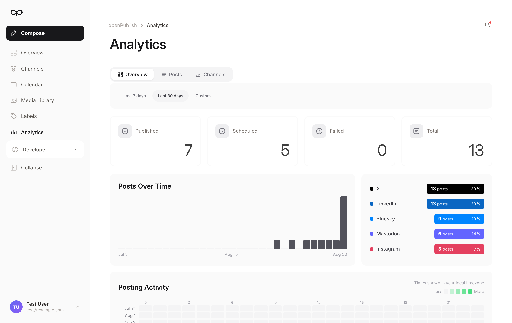
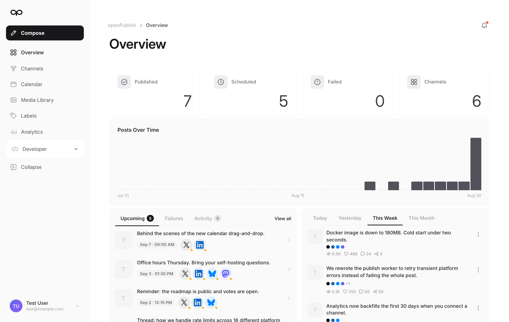

<div align="center">
  

  <h1>Open Source Social Media Scheduler</h1>

  <p><strong>Self-hosted social media scheduling for 16 platforms. Compose once, publish everywhere, own your data.</strong></p>

  <p>
    
    
    
    
    
    
  </p>

  <p>
    
    
    
    
    
    
    
    
    
    
    
    
    
    
    
  </p>

  <p>
    <a href="#quick-start"><strong>Quick Start »</strong></a> ·
    <a href="#screenshots">Screenshots</a> ·
    <a href="#supported-platforms">Platforms</a> ·
    <a href="#configuration">Configuration</a> ·
    <a href="#faq">FAQ</a>
  </p>

  <br/>

  

  <br/>
  <br/>
</div>

> [!IMPORTANT]
> ## This project is no longer maintained
>
> openPublish is archived as of **14 September 2026**. There will be no further
> releases, and issues and pull requests are no longer being reviewed.
>
> Keeping two separate applications in step turned out to be more work than one
> team can carry, so the effort now goes into
> **[BulkPublish](https://www.bulkpublish.com)** — the hosted product this was
> extracted from. It is actively developed and well ahead of the code here: no
> developer apps to register or get reviewed, bulk composing, recurring
> schedules, RSS-driven posting, link shortening with click tracking, an inbox
> for comments and DMs, team review and approval, a REST API with maintained
> SDKs and integrations, and a mobile app. There is a free
> plan, so you can try it without paying: **https://www.bulkpublish.com**
>
> The code stays here, under AGPL-3.0, and you are welcome to keep running or
> forking it — but treat it as a snapshot. It will not get platform API changes,
> security fixes or new features, and `ENGINE=cloud` will drift out of step with
> the BulkPublish API over time.

**openPublish** is a free, open source social media scheduler you host yourself. Write a post once, tailor it per network, schedule it on a calendar, and let the background workers publish it to X (Twitter), Instagram, TikTok, LinkedIn, YouTube, Facebook, Threads, Bluesky, Mastodon, Pinterest, Reddit, Discord, Telegram, Tumblr, Snapchat and Google Business Profile.

No seat pricing, no per-post limits, no analytics vendor in the middle. Your access tokens are encrypted in your own Postgres, your media sits on your own disk, and the whole thing runs from one `docker compose up`.

```bash
git clone https://github.com/azeemkafridi/openpublish.git
cd openpublish
cp .env.example .env          # set BETTER_AUTH_SECRET + ENCRYPTION_KEY
docker compose up -d          # http://localhost:4321
```

## Why a self-hosted social media scheduler?

Most social media scheduling tools are SaaS: you pay per user per month, your content and access tokens live on someone else's servers, and the features you actually use sit behind the next tier up. openPublish is the same product shape — composer, calendar, queue, analytics — with the economics removed.

- **Own your data.** Posts, media, metrics and OAuth tokens stay in your Postgres and on your disk. Tokens are encrypted at rest with your own key.
- **No limits by design.** There is no plan gate, no channel cap, no monthly post quota. The quota layer exists in the code and always answers "allowed".
- **One command to run.** Postgres, Redis, web and workers come up together with Docker Compose. Local-disk media storage by default — no S3 bucket required.
- **Real publishing, not a wrapper.** Per-platform handlers, a BullMQ job queue, token refresh, retry on transient platform errors, and status checks for platforms that publish asynchronously.
- **Two ways to run it.** Bring your own platform API keys, or point it at the BulkPublish cloud API and skip platform app registration entirely (see [Two ways to run](#two-ways-to-run)).

## Screenshots

<table>
  <tr>
    <td width="50%">
      
      <p align="center"><strong>Content calendar</strong> — month and day views, drag to reschedule, filter by status.</p>
    </td>
    <td width="50%">
      
      <p align="center"><strong>Channels</strong> — connect multiple accounts per platform, health and token status at a glance.</p>
    </td>
  </tr>
  <tr>
    <td width="50%">
      
      <p align="center"><strong>Analytics</strong> — impressions, engagement and posting activity, synced from each platform.</p>
    </td>
    <td width="50%">
      
      <p align="center"><strong>Overview</strong> — what published, what is queued, what failed, and why.</p>
    </td>
  </tr>
</table>

## Features

| Feature | What it does |
|---|---|
| **Multi-platform composer** | One editor, 16 networks. Per-platform content overrides, live preview per network, per-platform character counters and validation. |
| **Post types** | Standard posts, videos, reels and shorts, stories, carousels, and threads — with the media rules each platform enforces. |
| **Scheduling** | Pick a time in any timezone, or drop a post into the next free queue slot. A per-minute worker publishes what is due. |
| **Content calendar** | Month and day views, status filters, drag-and-drop rescheduling. |
| **Media library** | Upload images and video, automatic thumbnails and previews, video poster frames, reusable across posts. |
| **Analytics** | Post and account metrics pulled from each platform, engagement rates, posting-activity heatmap, per-channel breakdowns. |
| **Labels** | Tag posts and media, then filter the calendar and library by campaign or topic. |
| **REST API** | API-key authenticated endpoints for everything above, with a built-in Scalar reference at `/docs`. |
| **Notifications** | In-app and email alerts when a post fails or a channel's token needs reconnecting. |

## Quick Start

### Docker (recommended)

```bash
git clone https://github.com/azeemkafridi/openpublish.git
cd openpublish
cp .env.example .env
```

Generate the two required secrets and put them in `.env`:

```bash
openssl rand -hex 32   # BETTER_AUTH_SECRET
openssl rand -hex 32   # ENCRYPTION_KEY — encrypts platform tokens at rest
```

Then start everything:

```bash
docker compose up -d
```

Open <http://localhost:4321>, register the first account, and connect a channel.

### From source

```bash
npm install --legacy-peer-deps
cp .env.example .env            # fill in the CORE section
docker compose up -d postgres redis
npm run dev:local               # web on :4321 (runs migrations first)
npm run worker:local            # background workers, second terminal
```

## Two ways to run

openPublish can publish with **your own** platform apps, or delegate to the BulkPublish cloud API. Same UI either way — set `ENGINE` in `.env`.

### `ENGINE=selfhost` (default) — bring your own API keys

You register a developer app on each network you want, put the credentials in `.env`, and your server does the publishing. Nothing leaves your machine.

Platforms are enabled individually, and any platform without credentials is hidden from the connect screen automatically:

```bash
PLATFORM_X=on
X_CLIENT_ID=...
X_CLIENT_SECRET=...
```

Three networks need **no developer app at all** and are the fastest way to see a real post go out:

| Platform | What you need |
|---|---|
| **Bluesky** | An app password from Settings → App Passwords |
| **Mastodon** | Nothing — the app registers itself with your instance |
| **Telegram** | A bot token from [@BotFather](https://t.me/botfather) |

### `ENGINE=cloud` — no platform apps, no approvals

Registering 14 developer apps is a lot of paperwork, and some networks (TikTok, YouTube, Meta) review each app individually before it can post. Cloud mode skips all of it: openPublish forwards publishing to the [BulkPublish](https://www.bulkpublish.com) API using their already-approved platform apps.

```bash
ENGINE=cloud
BULKPUBLISH_API_KEY=bp_...
```

> **Archived-project note:** cloud mode is not maintained here any more. It talks
> to a live API that keeps evolving, so expect it to break eventually. If cloud
> publishing is what you want, use [BulkPublish](https://www.bulkpublish.com)
> directly — it is the same publishing core with the parts this repo never got.

You keep the self-hosted UI; channel connections are made once in the BulkPublish dashboard and then appear in your instance automatically. Local workers stay idle in this mode.

## Supported platforms

| Platform | What you can publish | Metrics | Needs a developer app |
|---|---|:---:|:---:|
| X (Twitter) | Posts, threads | ✅ | Yes |
| Instagram | Feed photos, feed video, Reels, Stories, carousels | ✅ | Yes |
| Facebook Pages | Posts, Reels, Stories | ✅ | Yes |
| LinkedIn | Posts, multi-image, PDF carousels, articles | Company pages only | Yes |
| TikTok | Videos, photo slideshows | ✅ | Yes (app review) |
| YouTube | Videos, Shorts | ✅ | Yes (app review) |
| Threads | Text, image, video, carousels | ✅ | Yes |
| Pinterest | Pins, video pins, carousels | ✅ | Yes |
| Google Business Profile | Standard, event and offer posts | — | Yes |
| Reddit | Posts | ✅ | Yes |
| Discord | Posts | ✅ | Yes |
| Snapchat | Stories, saved stories, Spotlight | ✅ | Yes |
| Tumblr | Posts | — | Yes |
| **Bluesky** | Posts, threads | ✅ | **No** |
| **Mastodon** | Posts, threads | ✅ | **No** |
| **Telegram** | Posts | — | **No** |

Capabilities follow what each platform's API actually allows — the composer only offers the post types a network supports, and validates media against that network's rules before anything is sent. "Metrics" means per-post engagement data can be synced back; each platform reports a different subset, and the analytics screen labels the ones a network never returns rather than showing them as zero.

## Configuration

Everything is environment variables; `.env.example` documents each one. The essentials:

| Variable | Purpose |
|---|---|
| `DATABASE_URL` | Postgres connection string |
| `REDIS_URL` | Redis, used for the job queue |
| `BASE_URL` | Public URL of your instance — OAuth callbacks and media URLs are built from it |
| `BETTER_AUTH_SECRET` | Session signing secret |
| `ENCRYPTION_KEY` | Encrypts platform access tokens at rest |
| `ENGINE` | `selfhost` (default) or `cloud` |
| `STORAGE` | `local` (default, files under `MEDIA_DIR`) or `s3` for any S3-compatible bucket |
| `PLATFORM_<NAME>` | `on` / `connect_off` / `off` per platform |
| `RESEND_API_KEY` | Optional — transactional email for verification and failure alerts |

## REST API

Every screen is backed by an API you can drive yourself. Create a key on the **Developer → API** page and call it with a bearer token:

```bash
curl -X POST http://localhost:4321/api/posts \
  -H "Authorization: Bearer bp_your_key_here" \
  -H "Content-Type: application/json" \
  -d '{
    "content": "Shipping today.",
    "channels": [{ "channelId": 1 }, { "channelId": 2 }],
    "status": "scheduled",
    "scheduledAt": "2026-09-01T09:00:00.000Z"
  }'
```

The full reference — every endpoint, schema and example — renders at **`/docs`** on your own instance, from the `openapi.json` in this repo.

## Architecture

- **Astro 5 SSR** with React islands for the app UI
- **PostgreSQL** via Drizzle ORM, with migrations applied automatically on container start
- **BullMQ on Redis** for publishing, status checks, token refresh, metrics sync and media cleanup
- **better-auth** for sessions (email/password, optional Google sign-in)
- **Local disk or S3** for media, with sharp/ffmpeg for thumbnails and video posters

One Docker image runs as `APP_MODE=web`, `worker`, or `all`.

## FAQ

**Is this still maintained?**
No. The project is archived as of 14 September 2026 and gets no further releases.
Development continues on the hosted product it came from,
[BulkPublish](https://www.bulkpublish.com), which has a free plan. The answers
below describe openPublish as it stands, for anyone running or forking the
snapshot.

**Is there a good open source alternative to Buffer or Hootsuite?**
That is what openPublish is. It covers the parts most people actually use — a multi-platform composer, a scheduling calendar, a posting queue, and engagement analytics — without per-seat pricing. You host it, so the only cost is your server.

**Is openPublish really free?**
Yes. It is licensed under AGPL-3.0 with no paid tier, no feature flags, and no telemetry. If you use the optional cloud engine, that service is billed by BulkPublish; self-hosted mode costs nothing beyond hosting.

**Do I need API keys for every platform?**
Only in self-host mode, and only for the platforms you actually want. Bluesky, Mastodon and Telegram need no developer app at all. If you would rather skip platform registration entirely, run in cloud mode.

**Can I schedule posts to multiple accounts on the same platform?**
Yes — connect as many accounts per platform as you like and select any combination when composing.

**Can I write different copy for each network?**
Yes. The composer supports per-platform content overrides with live previews and each network's character limit, so a thread on X and a long-form post on LinkedIn come from the same draft.

**Where are my access tokens stored?**
Encrypted with `ENCRYPTION_KEY` in your own Postgres database. They are never sent anywhere except to the platform they belong to.

**What are the system requirements?**
Anything that runs Docker. Postgres, Redis and the app comfortably fit on a 1GB VPS for personal use.

**Does it work behind a reverse proxy?**
Yes. Set `BASE_URL` to your public HTTPS URL and point your proxy at port 4321.

## Contributing

**This repository is archived — issues and pull requests are not being reviewed.**
Fork it and carry it forward if you want to; the checks below are what CI used to
run, kept here for anyone doing that. For the maintained product, see
[BulkPublish](https://www.bulkpublish.com).

If you are working in a fork:

```bash
npx tsc --noEmit --skipLibCheck   # type check
npm test                          # 2153 unit + API tests
npm run db:generate               # only if you changed src/lib/db/schema.ts
```

Schema changes must ship with their generated migration in the same commit.

## License

[AGPL-3.0](LICENSE). You can run, modify and self-host openPublish freely. If you offer it to others as a hosted service, your modifications must be published under the same license.
